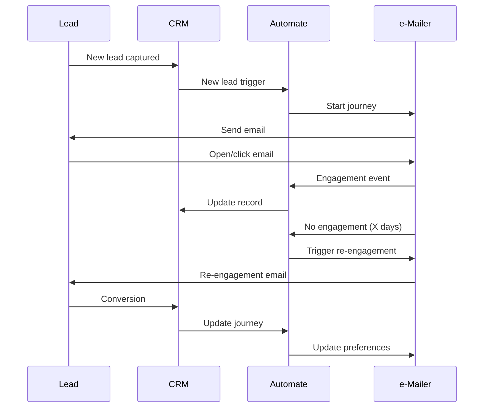
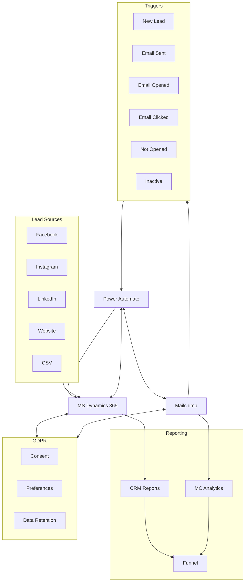

# FourDotPay GTM Infrastructure Summary

## Overview & Core Components
FourDotPay's GTM infrastructure automates lead capture, nurturing, and conversion across multiple audience segments using the following components:
- **Microsoft Dynamics 365**: Central CRM and single source of truth
- **Microsoft Power Automate**: Workflow automation and system integration
- **Mailchimp**: Email campaign management and analytics

## Data Flow Process

## Audience Segmentation
- **Content Creators**: Targeted campaigns based on engagement and interests
- **Website Agencies**: Focused on lead nurturing and conversion
- **Enterprise Businesses**: Custom journeys to be defined

## System Architecture & Data Flow

## Customer Journeys

**Audience Segments:**
- **Content Creators**: 3-part journey (12 weeks total)
  - *Journey 1*: Creator Economy (4 emails, weekly)
    - *Journey 1a*: Order e-mail:  1,2,3,4 
    - *Journey 1b*: Order e-mail:  2,1,3,4
    - *Journey 1c*: Order e-mail:  3,1,2,4
    - *Journey 1d*: Order e-mail:  4,1,2,3
  - *Journey 2*: Convince & Convert (4 emails, weekly)
  - *Journey 3*: Customer Value Chain (4 emails, weekly)
- **Website Agencies**: 1-part journey (2 weeks)
  - *Journey 1*: Creator Economy (3 emails, weekly)
- **Enterprise Businesses**: To be defined

**Re-engagement:**
- Non-responders entered into "Spam Openers" journey
- Targeted re-engagement emails for inactive leads

## Capabilities & Tools

| Capability | Tool |
|------------|------|
| Lead Capture & Segmentation | MS Dynamics 365 |
| Workflow Automation | Power Automate |
| Email Marketing & Analytics | Mailchimp |
| Event Triggering | Power Automate |
| Customer Journey Management | Dynamics 365 & Power Automate |
| Data Synchronization | Power Automate or Connectors |
| Reporting & Analytics | Dynamics 365 & Mailchimp |
| GDPR Compliance | Built into all systems |

## Key Trigger Events
- New record created in CRM
- Email sent/opened/clicked
- Email not opened after X days
- No activity after X period

## Implementation Requirements

### Microsoft Dynamics 365
- Lead entity configuration with journey tracking fields
- Power Automate integration
- Custom reporting dashboards
- GDPR compliance configuration

### Power Automate
- Workflow development for all triggers
- System connections and error handling
- Conditional logic for journey branching

### Mailchimp
- Campaign template and automation setup
- API integration for data synchronization
- Analytics configuration

### Marketing
- Email content development
- Audience segmentation strategy
- Performance metrics definition

### Analytics
- Funnel reporting
- Lead attribution and engagement scoring

## GDPR Compliance
- Explicit consent capture and storage
- Preference management center
- Data retention policies
- Right to be forgotten process
