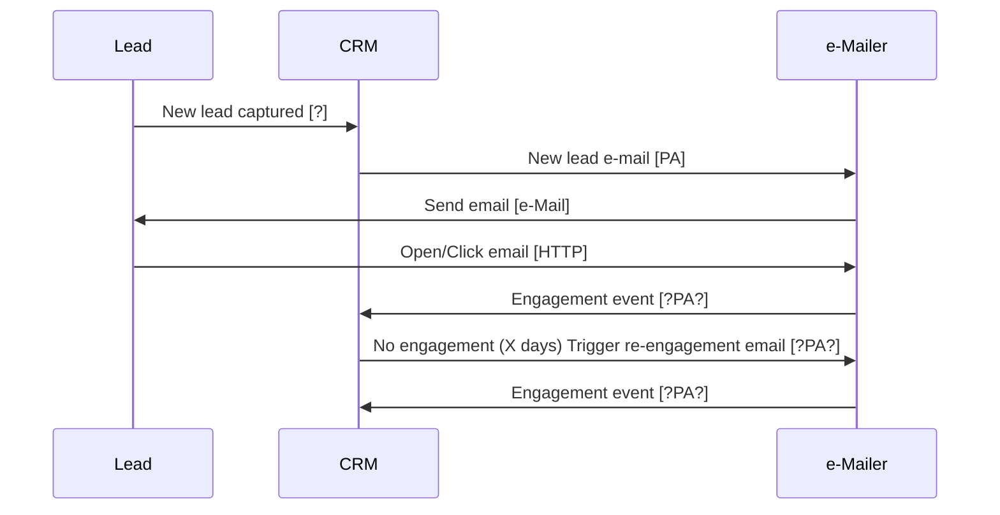
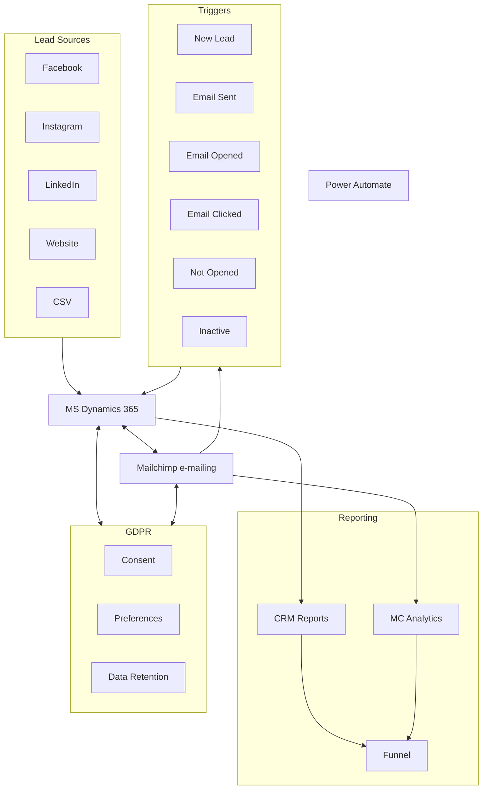

# GTM Design and System Architecture

## Overview & Guiding Principles

Fourdotpay's GTM infrastructure automates lead capture, nurturing, and conversion across multiple audience segments using the following principles:

1. **Lead Capture**: Automate lead capture from various sources (Facebook, Instagram, LinkedIn, Website, CSV) into a single source of truth.
2. **Automation**: Use a single tool to trigger workflows based on lead engagement and inactivity.
3. **E-mail Authoring**: Use a single tool for email delivery and analytics.
4. **Data Modeling**: Use a single data model for data modeling and reporting.
5. **Email Delivery**: Use a single tool for email delivery and analytics. DELIVERABILITY IS A CONCERN.
6. **Reporting**: Use a single tool for reporting and analytics.
7. **GDPR Compliance**: Ensure all systems are GDPR compliant.

## Marketing Needs

### Audience Segmentation

- **Content Creators**: Targeted campaigns based on engagement and interests
- **Website Agencies**: Focused on lead nurturing and conversion
- **Enterprise Businesses**: Custom journeys to be defined

### Customer Journeys

#### Customer Journey Initial Journey

1. **Content Creators**: 3-part journey (12 weeks total)
   1. _Journey 1_: Creator Economy (4 emails, weekly)
      1. a_Journey: Order e-mail: Start at tag: [1] then 2,3,4
      2. b_Journey: Order e-mail: Start at tag: [2] then 1,3,4
      3. c_Journey: Order e-mail: Start at tag: [3] then 1,2,4
      4. d_Journey: Order e-mail: Start at tag: [4] then 1,2,3
   2. _Journey 2_: Convince & Convert (4 emails, weekly)
   3. _Journey 3_: Customer Value Chain (4 emails, weekly)
2. **Website Agencies**: 1-part journey (2 weeks)
   1. _Journey 1_: Creator Economy (3 emails, weekly)
3. **Enterprise Businesses**: To be defined

#### Customer Journey Re-Engagement Journey

**Re-engagement:**

1. Non-responders entered into "Spam Openers" journey
2. Targeted re-engagement emails for inactive leads

---

## GTM Engineering Architecture Design and Implementation

## Open Architecture & Design Questions

| #    | Question                                                                            | Response                   |
| :--- | :---------------------------------------------------------------------------------- | :------------------------- |
| 1    | Does Dynamics have triggers YES it has it's own workflow engine                     | Yes Processes or Workflows |
| 2    | Does we have an automation thing includes a services of activities or single action |                            |
| 3    | Should we update lead captures to go direct to Dynamics (currently in Mailchimp)    |                            |

## Flows and Outline

### Lead Flow Process



### System Architecture & Data Flow



### Capabilities & Tools Mapping

| Capability                  | Tool                         |
| :-------------------------- | :--------------------------- |
| Lead Capture & Segmentation | MS Dynamics 365 or Mailchimp |
| Workflow Automation         | Power Automate               |
| Email Delivery              | Mailchimp                    |
| Email Analytics             | Mailchimp                    |
| Event Triggering            | Mailchimp & Dynamics 365     |
| Customer Journey Management | Dynamics Workflow            |
| Lead Synchronization        | Power Automate or Connectors |
| Reporting & Analytics       | Dynamics 365 & Mailchimp     |
| GDPR Compliance             | Built into all systems       |

### Connectors Required

| #    | From      | To        | Fallback       |
| :--- | :-------- | :-------- | :------------- |
| 1    | Facebook  | Dynamics  | See list below |
| 2    | Instagram | Dynamics  |                |
| 3    | Tiktok    | Dynamics  |                |
| 4    | Mailchimp | Dynamics  |                |
| 5    | Dynamics  | Mailchimp |                |
| 6    | Dynamics  | BigQuery  |                |
| 7    | GA4       | Dynamics  |                |
| 8    | GA4       | BigQuery  | In situ        |

#### Connectors Fall Backs Options

1. Connectors
2. Power Automate with Connector
3. Power Automate with API

# Automation Overview

# Email Catalog

| email_id                   | email_name                     | Order | trigger_tag        | status          |
| :------------------------- | :----------------------------- | :---- | :----------------- | :-------------- |
| eml-1.1-cc-creeco-creEco   | Creator Economy Gated Content  | 1     | creatorEconomyPDF  | Being Redarfted |
| eml-1.2-cc-creeco-pay      | Pay Per Use Gated Content      | 2     | payPerUsePDF       | Being Redarfted |
| eml-1.3-cc-creeco-algo     | Beat The Algo Gated Content    | 3     | beatTheAlgoPDF     | Being Redarfted |
| eml-1.4-cc-creeco-audience | Audience Control Gated Content | 4     | audienceControlPDF | Being Redarfted |
| eml-2.1-cc-con&con         | Rise of Micro-content          | 1     | CreEco_completion  | In Progress     |
| eml-2.2-cc-con&con         | Payment Pain Points            | 2     | EML-2.1_sent       | In Progress     |
| eml-2.3-cc-con&con         | Introducing FourDotPay         | 3     | EML-2.2_sent       | In Progress     |
| eml-2.4-cc-con&con         | Getting Started Guide          | 4     | EML-2.3_sent       | In Progress     |
| eml-3.1-cc-custvalue-xxx   | TBD - Value Chain 1            | 1     | Con&Con_completion | Planned         |
| eml-3.2-cc-custvalue-xxx   | TBD - Value Chain 2            | 2     | EML-3.1_sent       | Planned         |
| eml-3.3-cc-custvalue-xxx   | TBD - Value Chain 3            | 3     | EML-3.2_sent       | Planned         |
| eml-3.4-cc-custvalue-xxx   | TBD - Value Chain 4            | 4     | EML-3.3_sent       | Planned         |
| eml-4.1-wd-scene           | Setting the Scene              | 1     | webAgencyTarget    | Planned         |
| eml-4.2-wd-prop            | Value Proposition              | 2     | EML-4.1_sent       | Planned         |
| eml-4.3-wd-casestudy       | Case Study                     | 3     | EML-4.2_sent       | Planned         |
| eml-5.1-re-eng-xxx         | 3 Quick Questions              | 1     | nonResponder       | Planned         |
| eml-5.2-re-eng-xxx         | Repeat of 1                    | 2     | EML-5.1_no_open    | Planned         |
| eml-5.3-re-eng-xxx         | TBD - Final Attempt            | 3     | EML-5.2_no_open    | Planned         |
| eml-5.4-re-eng-xxx         | Repeat of 3                    | 4     | EML-5.3_no_open    | Planned         |
| eml-6.1-inactlead          | We Miss You                    | 1     | inactive30Days     | Planned         |
| eml-6.2-inactlead          | Final Notice                   | 2     | EML-6.1_no_open    | Planned         |

## Key Trigger Events

- New record created in CRM
- Email sent/opened/clicked
- Email not opened after X days
- No activity after X period

## Automation Catalog

| ID               | Step      | Action                       | Trigger event             | Source    | Destination | Connection Type | Data Fields                                            |
| :--------------- | :-------- | :--------------------------- | :------------------------ | :-------- | :---------- | :-------------- | :----------------------------------------------------- |
| Aut-01-New-Lead  | Capture   | Add new lead                 | New Lead Record           | Meta/Web  | Dynamics    | m2d1            | email_address, FNAME, LNAME, Date Created, Tag, Source |
| Aut-02-Analytics | Analytics | Capture open/click events    | New Event (open/click)    | Mailchimp | Dynamics    | m2d2            | user_id, contactid, subject, description, to[], from[] |
| Aut-101-CreEco-1 | 1/4       | Send email EML-1.1-CC-CreEco | tag=creatorEconomyPDF +0  | Dynamics  | Mailchimp   | d2m             | email_address, e-mail_ID                               |
| Aut-101-CreEco-1 | 2/4       | Send email EML-1.2-CC-CreEco | tag=creatorEconomyPDF +2  | Dynamics  | Mailchimp   | d2m             | email_address, e-mail_ID                               |
| Aut-101-CreEco-1 | 3/4       | Send email EML-1.3-CC-CreEco | tag=creatorEconomyPDF +4  | Dynamics  | Mailchimp   | d2m             | email_address, e-mail_ID                               |
| Aut-101-CreEco-1 | 4/4       | Send email EML-1.4-CC-CreEco | tag=creatorEconomyPDF +6  | Dynamics  | Mailchimp   | d2m             | email_address, e-mail_ID                               |
| Aut-102-CreEco-2 | 1/4       | Send email EML-1.2-CC-CreEco | tag=payPerUsePDF +0       | Dynamics  | Mailchimp   | d2m             | email_address, e-mail_ID                               |
| Aut-102-CreEco-2 | 2/4       | Send email EML-1.1-CC-CreEco | tag=payPerUsePDF +2       | Dynamics  | Mailchimp   | d2m             | email_address, e-mail_ID                               |
| Aut-102-CreEco-2 | 3/4       | Send email EML-1.3-CC-CreEco | tag=payPerUsePDF +4       | Dynamics  | Mailchimp   | d2m             | email_address, e-mail_ID                               |
| Aut-102-CreEco-2 | 4/4       | Send email EML-1.4-CC-CreEco | tag=payPerUsePDF +6       | Dynamics  | Mailchimp   | d2m             | email_address, e-mail_ID                               |
| Aut-103-CreEco-3 | 1/4       | Send email EML-1.3-CC-CreEco | tag=beatTheAlgoPDF +0     | Dynamics  | Mailchimp   | d2m             | email_address, e-mail_ID                               |
| Aut-103-CreEco-3 | 2/4       | Send email EML-1.1-CC-CreEco | tag=beatTheAlgoPDF +2     | Dynamics  | Mailchimp   | d2m             | email_address, e-mail_ID                               |
| Aut-103-CreEco-3 | 3/4       | Send email EML-1.2-CC-CreEco | tag=beatTheAlgoPDF +4     | Dynamics  | Mailchimp   | d2m             | email_address, e-mail_ID                               |
| Aut-103-CreEco-3 | 4/4       | Send email EML-1.4-CC-CreEco | tag=beatTheAlgoPDF +6     | Dynamics  | Mailchimp   | d2m             | email_address, e-mail_ID                               |
| Aut-104-CreEco-4 | 1/4       | Send email EML-1.3-CC-CreEco | tag=audienceControlPDF +0 | Dynamics  | Mailchimp   | d2m             | email_address, e-mail_ID                               |
| Aut-104-CreEco-4 | 2/4       | Send email EML-1.1-CC-CreEco | tag=audienceControlPDF +2 | Dynamics  | Mailchimp   | d2m             | email_address, e-mail_ID                               |
| Aut-104-CreEco-4 | 3/4       | Send email EML-1.2-CC-CreEco | tag=audienceControlPDF +4 | Dynamics  | Mailchimp   | d2m             | email_address, e-mail_ID                               |
| Aut-104-CreEco-4 | 4/4       | Send email EML-1.4-CC-CreEco | tag=audienceControlPDF +6 | Dynamics  | Mailchimp   | d2m             | email_address, e-mail_ID                               |

---

# Resources

## Microsoft Dynamics 365 Customer State Codes

### Account Entity

| StateCode | State Name | StatusCode | Status Reason |
| :-------: | :--------: | :--------: | :-----------: |
|     0     |   Active   |     1      |    Active     |
|     1     |  Inactive  |     2      |   Inactive    |

### Contact Entity

| StateCode | State Name | StatusCode | Status Reason |
| :-------: | :--------: | :--------: | :-----------: |
|     0     |   Active   |     1      |    Active     |
|     1     |  Inactive  |     2      |   Inactive    |

### Lead Entity

| StateCode |  State Name  | StatusCode |    Status Reason     |
| :-------: | :----------: | :--------: | :------------------: |
|     0     |     Open     |     1      |         New          |
|     0     |     Open     |     2      |      Contacted       |
|     1     |  Qualified   |     3      |      Qualified       |
|     2     | Disqualified |     4      |         Lost         |
|     2     | Disqualified |     5      |    Cannot Contact    |
|     2     | Disqualified |     6      | No Longer Interested |
|     2     | Disqualified |     7      |       Canceled       |

### Opportunity Entity

| StateCode | State Name | StatusCode | Status Reason |
| :-------: | :--------: | :--------: | :-----------: |
|     0     |    Open    |     1      |  In Progress  |
|     0     |    Open    |     2      |    On Hold    |
|     1     |    Won     |     3      |      Won      |
|     2     |    Lost    |     4      |   Canceled    |
|     2     |    Lost    |     5      |   Out-Sold    |

### Case (Incident) Entity

| StateCode | State Name | StatusCode |    Status Reason    |
| :-------: | :--------: | :--------: | :-----------------: |
|     0     |   Active   |     1      |     In Progress     |
|     0     |   Active   |     2      |       On Hold       |
|     0     |   Active   |     3      | Waiting for Details |
|     0     |   Active   |     4      |     Researching     |
|     1     |  Resolved  |     5      |   Problem Solved    |
|     2     |  Canceled  |     6      |      Canceled       |

## 1. Mailchimp User/Subscriber Entity Model

### Core Status and Identity Fields

| Field/Property  | Type    | Description                                            | Source                                                                                     |
| :-------------- | :------ | :----------------------------------------------------- | :----------------------------------------------------------------------------------------- |
| email_address   | String  | Primary identifier for subscribers                     | [Mailchimp API](https://mailchimp.com/developer/marketing/api/list-members/)               |
| status          | Enum    | Current subscriber status                              | [Mailchimp Documentation](https://mailchimp.com/help/about-your-contacts/)                 |
| unique_email_id | String  | Unique identifier across all of Mailchimp              | [Help Center](https://learn.azuqua.com/connector-reference/mailchimp/)                     |
| id              | String  | MD5 hash of lowercase email                            | [Methods & Parameters](https://mailchimp.com/developer/marketing/docs/methods-parameters/) |
| web_id          | Integer | ID for the subscriber in the Mailchimp web application | [API Reference](https://mailchimp.com/developer/marketing/api/)                            |
| list_id         | String  | ID of the list/audience the member belongs to          | [API Reference](https://mailchimp.com/developer/marketing/api/lists/)                      |

### Member Profile Fields

| Field/Property   | Type     | Description                                       | Source                                                                                             |
| :--------------- | :------- | :------------------------------------------------ | :------------------------------------------------------------------------------------------------- |
| merge_fields     | Object   | Custom fields for subscriber (FNAME, LNAME, etc.) | [API Examples](https://www.merge.dev/blog/how-to-add-a-subscriber-and-more-with-the-mailchimp-api) |
| interests        | Object   | Interest category selections for member           | [API Reference](https://mailchimp.com/developer/marketing/api/)                                    |
| language         | String   | Subscriber's language preference                  | [Help Center](https://learn.azuqua.com/connector-reference/mailchimp/)                             |
| vip              | Boolean  | VIP status of subscriber                          | [API Reference](https://mailchimp.com/developer/marketing/api/list-members/)                       |
| location         | Object   | Geographic data (latitude, longitude, etc.)       | [API Reference](https://mailchimp.com/developer/marketing/api/list-members/)                       |
| ip_signup        | String   | IP address used at signup                         | [Help Center](https://learn.azuqua.com/connector-reference/mailchimp/)                             |
| timestamp_signup | DateTime | When subscriber signed up                         | [Help Center](https://learn.azuqua.com/connector-reference/mailchimp/)                             |

### Analytics & Tracking Fields

| Field/Property | Type     | Description                              | Source                                                                       |
| :------------- | :------- | :--------------------------------------- | :--------------------------------------------------------------------------- |
| stats          | Object   | Open and click rate statistics           | [API Reference](https://mailchimp.com/developer/marketing/api/list-members/) |
| member_rating  | Integer  | Engagement score (1-5)                   | [Help Center](https://learn.azuqua.com/connector-reference/mailchimp/)       |
| last_changed   | DateTime | When subscriber record was last modified | [API Reference](https://mailchimp.com/developer/marketing/api/list-members/) |
| email_client   | String   | Subscriber's email client if detected    | [Help Center](https://learn.azuqua.com/connector-reference/mailchimp/)       |
| last_note      | Object   | Most recent note added about subscriber  | [API Reference](https://mailchimp.com/developer/marketing/api/)              |

### Tags and Categorization

| Field/Property | Type   | Description                         | Source                                                                                                             |
| :------------- | :----- | :---------------------------------- | :----------------------------------------------------------------------------------------------------------------- |
| tags           | Array  | List of tags assigned to subscriber | [Member Tags API](https://mailchimp.com/developer/marketing/api/list-member-tags/)                                 |
| tag.name       | String | Name of the tag                     | [Member Tags API](https://mailchimp.com/developer/marketing/api/list-member-tags/add-or-remove-member-tags/)       |
| tag.status     | String | Status of tag (active/inactive)     | [Stack Overflow](https://stackoverflow.com/questions/52298226/how-to-add-tags-to-mailchimp-subscriber-via-the-api) |

### Key API Endpoints for Email/Analytics

| Endpoint                                              | Description                  | Source                                                                             |
| :---------------------------------------------------- | :--------------------------- | :--------------------------------------------------------------------------------- |
| `/lists/{list_id}/members`                            | Manage list members          | [API Reference](https://mailchimp.com/developer/marketing/api/list-members/)       |
| `/lists/{list_id}/members/{subscriber_hash}`          | Get/update specific member   | [API Reference](https://mailchimp.com/developer/marketing/api/list-members/)       |
| `/lists/{list_id}/members/{subscriber_hash}/tags`     | Manage member tags           | [Member Tags API](https://mailchimp.com/developer/marketing/api/list-member-tags/) |
| `/lists/{list_id}/members/{subscriber_hash}/activity` | Get member activity          | [API Reference](https://mailchimp.com/developer/marketing/api/)                    |
| `/campaigns/{campaign_id}/send-test`                  | Send test email              | [API Reference](https://mailchimp.com/developer/marketing/api/)                    |
| `/campaigns/{campaign_id}/content`                    | Manage email content         | [API Reference](https://mailchimp.com/developer/marketing/api/)                    |
| `/campaigns/{campaign_id}/feedback`                   | Get/manage campaign feedback | [API Reference](https://mailchimp.com/developer/marketing/api/)                    |

## 2. Microsoft Dynamics 365 User/Contact Entity Model

### Core Status and Identity Fields

| Field/Property | Type   | Description                     | Source                                                                                                                                |
| :------------- | :----- | :------------------------------ | :------------------------------------------------------------------------------------------------------------------------------------ |
| id/contactid   | GUID   | Primary key/identifier          | [Entity Reference](https://learn.microsoft.com/en-us/dynamics365/customerengagement/on-premises/developer/entities/email?view=op-9-1) |
| statecode      | Enum   | Current state (Active/Inactive) | [State & Status Codes](https://www.msdynamicsblog.com/dynamics-crm-state-status-codes-for-common-entities/)                           |
| statuscode     | Enum   | Status reason within state      | [State & Status Codes](https://www.msdynamicsblog.com/dynamics-crm-state-status-codes-for-common-entities/)                           |
| emailaddress1  | String | Primary email address           | [FAQs about email tracking](https://learn.microsoft.com/en-us/dynamics365/outlook-app/user/faq-email-tracking)                        |
| emailaddress2  | String | Secondary email address         | [FAQs about email tracking](https://learn.microsoft.com/en-us/dynamics365/outlook-app/user/faq-email-tracking)                        |
| emailaddress3  | String | Tertiary email address          | [FAQs about email tracking](https://learn.microsoft.com/en-us/dynamics365/outlook-app/user/faq-email-tracking)                        |

### Contact/Account Profile Fields

| Field/Property | Type     | Description            | Source                                                                                                                                |
| :------------- | :------- | :--------------------- | :------------------------------------------------------------------------------------------------------------------------------------ |
| firstname      | String   | First name             | [Entity Reference](https://learn.microsoft.com/en-us/dynamics365/customerengagement/on-premises/developer/entities/email?view=op-9-1) |
| lastname       | String   | Last name              | [Entity Reference](https://learn.microsoft.com/en-us/dynamics365/customerengagement/on-premises/developer/entities/email?view=op-9-1) |
| fullname       | String   | Full name (computed)   | [Entity Reference](https://learn.microsoft.com/en-us/dynamics365/customerengagement/on-premises/developer/entities/email?view=op-9-1) |
| telephone1     | String   | Primary phone number   | [Entity Reference](https://learn.microsoft.com/en-us/dynamics365/customerengagement/on-premises/developer/entities/email?view=op-9-1) |
| address1\_\*   | Various  | Primary address fields | [Entity Reference](https://learn.microsoft.com/en-us/dynamics365/customerengagement/on-premises/developer/entities/email?view=op-9-1) |
| ownerid        | Lookup   | Owner of the record    | [Entity Reference](https://learn.microsoft.com/en-us/dynamics365/customerengagement/on-premises/developer/entities/email?view=op-9-1) |
| createdon      | DateTime | Record creation date   | [Entity Reference](https://learn.microsoft.com/en-us/dynamics365/customerengagement/on-premises/developer/entities/email?view=op-9-1) |
| modifiedon     | DateTime | Last modified date     | [Entity Reference](https://learn.microsoft.com/en-us/dynamics365/customerengagement/on-premises/developer/entities/email?view=op-9-1) |

### Email Entity Fields

| Field/Property    | Type       | Description                           | Source                                                                                                                                                |
| :---------------- | :--------- | :------------------------------------ | :---------------------------------------------------------------------------------------------------------------------------------------------------- |
| subject           | String     | Email subject                         | [Email Activity Entities](https://learn.microsoft.com/en-us/dynamics365/customerengagement/on-premises/developer/email-activity-entities?view=op-9-1) |
| description       | String     | Email body content                    | [Email Activity Entities](https://learn.microsoft.com/en-us/dynamics365/customerengagement/on-premises/developer/email-activity-entities?view=op-9-1) |
| to                | Party List | Recipients (lookup to contacts/users) | [Activity Party](https://promx.net/en/2020/01/how-to-retrieve-an-activity-party-list-in-microsoft-dynamics-365-using-web-api/)                        |
| from              | Party List | Sender (lookup to contacts/users)     | [Activity Party](https://promx.net/en/2020/01/how-to-retrieve-an-activity-party-list-in-microsoft-dynamics-365-using-web-api/)                        |
| cc                | Party List | CC recipients                         | [Activity Party](https://promx.net/en/2020/01/how-to-retrieve-an-activity-party-list-in-microsoft-dynamics-365-using-web-api/)                        |
| bcc               | Party List | BCC recipients                        | [Activity Party](https://promx.net/en/2020/01/how-to-retrieve-an-activity-party-list-in-microsoft-dynamics-365-using-web-api/)                        |
| regardingobjectid | Lookup     | Record the email is regarding         | [Email Activity Entities](https://learn.microsoft.com/en-us/dynamics365/customerengagement/on-premises/developer/email-activity-entities?view=op-9-1) |
| activityid        | GUID       | Primary key for activity record       | [Email Activity Entities](https://learn.microsoft.com/en-us/dynamics365/customerengagement/on-premises/developer/email-activity-entities?view=op-9-1) |

### Email Tracking and Analytics

| Field/Property    | Type    | Description                   | Source                                                                                                                                                               |
| :---------------- | :------ | :---------------------------- | :------------------------------------------------------------------------------------------------------------------------------------------------------------------- |
| trackingtoken     | String  | Token for email tracking      | [Use correlation to track email](https://learn.microsoft.com/en-us/dynamics365/customerengagement/on-premises/admin/email-message-filtering-correlation?view=op-9-1) |
| conversationindex | String  | For threading related emails  | [FAQs about email tracking](https://learn.microsoft.com/en-us/dynamics365/outlook-app/user/faq-email-tracking)                                                       |
| isemailtracked    | Boolean | Indicates if email is tracked | [Overview of tracking records](https://learn.microsoft.com/en-us/dynamics365/outlook-addin/user-guide/overview-tracking-records)                                     |
| senderstatus      | Integer | Status of the send operation  | [Email Activity Entities](https://learn.microsoft.com/en-us/dynamics365/customerengagement/on-premises/developer/email-activity-entities?view=op-9-1)                |
| trackingid        | GUID    | For tracking analytics        | [TrackingContext Reference](https://learn.microsoft.com/en-us/dynamics365/developer/reference/entities/msdynmkt_trackingcontext)                                     |

### Key API Endpoints for Email/Contact Management

| Endpoint                         | Description               | Source                                                                                                                                                               |
| :------------------------------- | :------------------------ | :------------------------------------------------------------------------------------------------------------------------------------------------------------------- |
| `/api/data/v9.2/contacts`        | Manage contacts           | [Web API](https://learn.microsoft.com/en-us/power-apps/developer/data-platform/webapi/query-metadata-web-api)                                                        |
| `/api/data/v9.2/emails`          | Manage email records      | [Email table/entity reference](https://learn.microsoft.com/en-us/power-apps/developer/data-platform/reference/entities/email)                                        |
| `/api/data/v9.2/activityparties` | Manage email recipients   | [Activity Party List](https://promx.net/en/2020/01/how-to-retrieve-an-activity-party-list-in-microsoft-dynamics-365-using-web-api/)                                  |
| `/api/data/v9.2/SendEmail`       | Send email message        | [Email Activity Entities](https://learn.microsoft.com/en-us/dynamics365/customerengagement/on-premises/developer/email-activity-entities?view=op-9-1)                |
| `/api/data/v9.2/SendTemplate`    | Send email using template | [Email Activity Entities](https://learn.microsoft.com/en-us/dynamics365/customerengagement/on-premises/developer/email-activity-entities?view=op-9-1)                |
| `/api/data/v9.2/TrackEmail`      | Track email activity      | [Use correlation to track email](https://learn.microsoft.com/en-us/dynamics365/customerengagement/on-premises/admin/email-message-filtering-correlation?view=op-9-1) |

## Key Differences and Similarities

### Primary Identifiers

- **Mailchimp**: Uses email address as primary identifier with MD5 hash for API operations
- **Dynamics 365**: Uses GUIDs for all entities with multiple email address fields per contact

### Status Management

- **Mailchimp**: Simple enum with 5 statuses (subscribed, unsubscribed, cleaned, pending, transactional)
- **Dynamics 365**: Two-level status system with statecode and statuscode for more granular state management

### Email Tracking

- **Mailchimp**: Primarily focuses on analytics (opens/clicks) with simple tag-based categorization
- **Dynamics 365**: Comprehensive tracking with correlation features, threading, and activity relationships

### API Structure

- **Mailchimp**: RESTful API with clear resource hierarchy around lists/audiences and members
- **Dynamics 365**: OData-based Web API with complex entity relationships and lookup fields

### Sources

For Mailchimp:

- [Mailchimp Marketing API Reference](https://mailchimp.com/developer/marketing/api/)
- [Mailchimp Help Center](https://mailchimp.com/help/about-your-contacts/)

For Microsoft Dynamics 365:

- [Dynamics 365 Entity Reference](https://learn.microsoft.com/en-us/dynamics365/customerengagement/on-premises/developer/entities/email?view=op-9-1)
- [Microsoft Dataverse Web API Reference](https://learn.microsoft.com/en-us/power-apps/developer/data-platform/webapi/reference/email)

---

---

# REQUIRED ONLY IS CONNECTORS ARE NOT AVAILABLE - Connectivity Flow Operations: Mailchimp ↔ Dynamics 365 Integration (with Documentation Links)

## 1. New User Record: Mailchimp → Dynamics 365 (m2d1)

| Component                | Description                                                                                                                                       |
| :----------------------- | :------------------------------------------------------------------------------------------------------------------------------------------------ |
| **Source API Endpoint**  | `https://{dc}.api.mailchimp.com/3.0/lists/{list_id}/members/{subscriber_hash}`                                                                    |
| **Documentation Link**   | [Get list member info](https://mailchimp.com/developer/marketing/api/list-members/get-member-info/)                                               |
| **HTTP Verb**            | GET                                                                                                                                               |
| **Auth Model**           | Basic Auth (API Key as password, "anystring" as username)                                                                                         |
| **Headers**              | `Authorization: Basic {base64_encoded_string}`, `Content-Type: application/json`                                                                  |
| **Required Path Params** | `list_id` (string, audience ID), `subscriber_hash` (string, MD5 hash of lowercase email address)                                                  |
| **Target API Endpoint**  | `https://{dynamics-url}/api/data/v9.2/contacts`                                                                                                   |
| **Documentation Link**   | [Create contact Web API](https://learn.microsoft.com/en-us/power-apps/developer/data-platform/webapi/create-entity-web-api)                       |
| **HTTP Verb**            | POST                                                                                                                                              |
| **Auth Model**           | OAuth 2.0 with Azure AD                                                                                                                           |
| **Headers**              | `Authorization: Bearer {token}`, `Content-Type: application/json`, `OData-MaxVersion: 4.0`, `OData-Version: 4.0`, `Prefer: return=representation` |

#### Response Fields Structure

```json
{
  "id": "string",
  "email_address": "string",
  "unique_email_id": "string",
  "email_type": "string",
  "status": "subscribed|unsubscribed|cleaned|pending|transactional",
  "merge_fields": {

    "FNAME": "string",
    "LNAME": "string",
    "ADDRESS": {},
    "PHONE": "string",
    // Other custom merge fields
  },
  "stats": {
    "avg_open_rate": number,
    "avg_click_rate": number
  },
  "ip_signup": "string",
  "timestamp_signup": "string",
  "ip_opt": "string",
  "timestamp_opt": "string",
  "tags": [{"id": number, "name": "string"}]
}

```

#### **Required Request Body** See Below

```json
{
  "firstname": "string", // Mailchimp merge_fields.FNAME
  "lastname": "string", // Mailchimp merge_fields.LNAME
  "emailaddress1": "string", // Mailchimp email_address
  "telephone1": "string", // Mailchimp merge_fields.PHONE
  "address1_line1": "string", // Mailchimp merge_fields.ADDRESS.addr1
  "address1_city": "string", // Mailchimp merge_fields.ADDRESS.city
  "address1_stateorprovince": "string", // Mailchimp merge_fields.ADDRESS.state
  "address1_postalcode": "string", // Mailchimp merge_fields.ADDRESS.zip
  "address1_country": "string", // Mailchimp merge_fields.ADDRESS.country
  "msdyn_contactkpiid": { // For analytics integration (optional)
    "@odata.type": "Microsoft.Dynamics.CRM.msdyn_contactkpi",
    "msdyn_openrate": number, // Mailchimp stats.avg_open_rate
    "msdyn_clickrate": number // Mailchimp stats.avg_click_rate
  },
  "customertypecode": 1 // 1=Customer, 2=Prospect
}
```

## 2. New Email: Dynamics 365 → Mailchimp (d2m)

| Component                                 | Description                                                                                                             |
| :---------------------------------------- | :---------------------------------------------------------------------------------------------------------------------- |
| **Source API Endpoint**                   | `https://{dynamics-url}/api/data/v9.2/emails({email_id})`                                                               |
| **Documentation Link**                    | [Email entity reference](https://learn.microsoft.com/en-us/power-apps/developer/data-platform/reference/entities/email) |
| **HTTP Verb**                             | GET                                                                                                                     |
| **Auth Model**                            | OAuth 2.0 with Azure AD                                                                                                 |
| **Headers**                               | `Authorization: Bearer {token}`, `Accept: application/json`, `OData-MaxVersion: 4.0`, `OData-Version: 4.0`              |
| **Required Path Params**                  | `email_id` (GUID of the email activity)                                                                                 |
| **Optional Query Params**                 | `$expand=email_activity_parties` (to get recipient details)                                                             |
| **Target API Endpoint (Create Campaign)** | `https://{dc}.api.mailchimp.com/3.0/campaigns`                                                                          |
| **Documentation Link**                    | [Add campaign](https://mailchimp.com/developer/marketing/api/campaigns/add-campaign/)                                   |
| **HTTP Verb**                             | POST                                                                                                                    |
| **Auth Model**                            | Basic Auth (API Key as password, "anystring" as username)                                                               |
| **Headers**                               | `Authorization: Basic {base64_encoded_string}`, `Content-Type: application/json`                                        |

| **Target API Endpoint (Set Content)** | `https://{dc}.api.mailchimp.com/3.0/campaigns/{campaign_id}/content` |
| **Documentation Link** | [Set campaign content](https://mailchimp.com/developer/marketing/api/campaign-content/set-campaign-content/) |
| **HTTP Verb** | PUT |
| **Required Path Params** | `campaign_id` (string, from campaign creation response) |
| **Required Request Body** | "html": "string" // From Dynamics email.description|
| **Target API Endpoint (Send)** | `https://{dc}.api.mailchimp.com/3.0/campaigns/{campaign_id}/actions/send` |
| **Documentation Link** | [Send campaign](https://mailchimp.com/developer/marketing/api/campaigns/send-campaign/) |
| **HTTP Verb** | POST |
| **Required Path Params** | `campaign_id` (string, from campaign creation response) |

#### **Response Fields Structure**

```json
{
  "subject": "string",
  "description": "string", // Email body (HTML)
  "directioncode": boolean, // true=outgoing, false=incoming
  "statuscode": number, // Status reason
  "email_activity_parties": [

    {
      "participationtypemask": number, // 1=From, 2=To, 3=CC, 4=BCC
      "_partyid_value": "GUID", // Reference to contact/account/lead
      "addressused": "string" // Email address
    }
  ],
  "<regardingobjectid_contact@odata.bind>": "/contacts(GUID)"
}

```

#### **Required Request Body**

```json
{
  "type": "regular",
  "recipients": {
    "list_id": "string", // Your audience ID
    "segment_opts": {
      "saved_segment_id": number, // Optional
      "match": "any", // any or all
      "conditions": [ // Dynamic segment to match specific contacts
        {
          "condition_type": "TextMerge",
          "field": "EMAIL",
          "op": "is",
          "value": "email@example.com" // From Dynamics email recipients
        }
      ]
    }
  },
  "settings": {
    "subject_line": "string", // From Dynamics email.subject
    "from_name": "string", // Sender name
    "reply_to": "string", // Reply email
    "auto_footer": false,
    "template_id": number // Optional template ID
  }
}
```

## 3. Analytics: Mailchimp → Dynamics 365 (m2d2)

| Component                                | Description                                                                                                               |
| :--------------------------------------- | :------------------------------------------------------------------------------------------------------------------------ |
| **Source API Endpoint (Report)**         | `https://{dc}.api.mailchimp.com/3.0/reports/{campaign_id}`                                                                |
| **Documentation Link**                   | [Get campaign report](https://mailchimp.com/developer/marketing/api/reports/get-campaign-report/)                         |
| **HTTP Verb**                            | GET                                                                                                                       |
| **Auth Model**                           | Basic Auth (API Key as password, "anystring" as username)                                                                 |
| **Headers**                              | `Authorization: Basic {base64_encoded_string}`, `Content-Type: application/json`                                          |
| **Required Path Params**                 | `campaign_id` (string, campaign ID)                                                                                       |
| **Source API Endpoint (Email Activity)** | `https://{dc}.api.mailchimp.com/3.0/reports/{campaign_id}/email-activity`                                                 |
| **Documentation Link**                   | [Get email activity](https://mailchimp.com/developer/marketing/api/email-activity-reports/get-subscriber-email-activity/) |
| **HTTP Verb**                            | GET                                                                                                                       |
| **Required Path Params**                 | `campaign_id` (string, campaign ID)                                                                                       |
| **Optional Query Params**                | `count`, `offset`, `email` (filter by specific subscriber)                                                                |

##### **Response Fields Structure**

```json
{
  "id": "string",
  "campaign_title": "string",
  "type": "string",
  "emails_sent": number,
  "abuse_reports": number,
  "unsubscribed": number,
  "send_time": "string", // ISO date
  "bounces": {
    "hard_bounces": number,
    "soft_bounces": number,
    "syntax_errors": number
  },
  "forwards": {
    "forwards_count": number,
    "forwards_opens": number
  },
  "opens": {
    "opens_total": number,
    "unique_opens": number,
    "open_rate": number,
    "last_open": "string" // ISO date
  },
  "clicks": {
    "clicks_total": number,
    "unique_clicks": number,
    "unique_subscriber_clicks": number,
    "click_rate": number,
    "last_click": "string" // ISO date
  }
}
```

#### **Response Fields Structure**

```json
{
  "emails": [
    {
      "campaign_id": "string",
      "list_id": "string",
      "email_id": "string",
      "email_address": "string",
      "activity": [
        {
          "action": "open|click|bounce|etc",
          "timestamp": "string", // ISO date
          "url": "string", // For clicks
          "type": "string" // For bounces
        }
      ]
    }
  ]
}
```

| **Target API Endpoint (Marketing Analytics)** | `https://{dynamics-url}/api/data/v9.2/msdynmkt_marketingemailclicks` |
| **Documentation Link** | [Marketing email click entity](https://learn.microsoft.com/en-us/dynamics365/marketing/developer/marketing-email-click-entity-reference) |
| **HTTP Verb** | POST |
| **Auth Model** | OAuth 2.0 with Azure AD |
| **Headers** | `Authorization: Bearer {token}`, `Content-Type: application/json`, `OData-MaxVersion: 4.0`, `OData-Version: 4.0` |

#### **Required Request Body (Click Event)**

```json
{
  "msdynmkt_clickedurl": "string", // URL that was clicked
  "msdynmkt_timestamp": "2023-01-01T00:00:00Z", // From Mailchimp activity timestamp
  "msdynmkt_marketingemail@odata.bind": "/msdynmkt_marketingemails(GUID)", // Related email
  "msdynmkt_contact@odata.bind": "/contacts(GUID)" // Related contact
}
```

| **Target API Endpoint (Marketing Opens)** | `https://{dynamics-url}/api/data/v9.2/msdynmkt_marketingemailopens` |
| **HTTP Verb** | POST |

#### **Required Request Body (Open Event)**

```json
{
  "msdynmkt_opentime": "2023-01-01T00:00:00Z", // From Mailchimp activity timestamp
  "msdynmkt_browserinfo": "string", // Optional user agent info
  "msdynmkt_marketingemail@odata.bind": "/msdynmkt_marketingemails(GUID)",
  "msdynmkt_contact@odata.bind": "/contacts(GUID)"
}
```

| **Alternative Target (Custom Entity)** | `https://{dynamics-url}/api/data/v9.2/cr3f5_emailanalytics` |
| **Documentation Link** | [Create custom entity](https://learn.microsoft.com/en-us/power-apps/developer/data-platform/create-custom-entity) |

#### **Required Request Body (Custom)** |

```json
{
  "cr3f5_name": "string", // Campaign title
  "cr3f5_campaignid": "string", // Mailchimp campaign ID
  "cr3f5_emailssent": number,
  "cr3f5_opens": number,
  "cr3f5_uniqueopens": number,
  "cr3f5_openrate": number,
  "cr3f5_clicks": number,
  "cr3f5_uniqueclicks": number,
  "cr3f5_clickrate": number,
  "cr3f5_bounces": number,
  "cr3f5_unsubscribes": number,
  "cr3f5_campaign@odata.bind": "/campaigns(GUID)", // Optional related campaign
  "cr3f5_contact@odata.bind": "/contacts(GUID)" // Optional related contact
}
```

## **Key Documentation Links:**

### **Mailchimp**

- [Mailchimp API Root Documentation](https://mailchimp.com/developer/marketing/api/)
- [Authentication](https://mailchimp.com/developer/marketing/docs/fundamentals/#authentication)
- [Lists/Audiences API](https://mailchimp.com/developer/marketing/api/lists/)
- [List Members API](https://mailchimp.com/developer/marketing/api/list-members/)
- [Campaigns API](https://mailchimp.com/developer/marketing/api/campaigns/)
- [Reports API](https://mailchimp.com/developer/marketing/api/reports/)

### **Dynamics 365**

- [Web API Overview](https://learn.microsoft.com/en-us/power-apps/developer/data-platform/webapi/overview)
- [Web API Reference](https://learn.microsoft.com/en-us/power-apps/developer/data-platform/webapi/reference/)
- [Authentication](https://learn.microsoft.com/en-us/power-apps/developer/data-platform/authentication)
- [Contact Entity Reference](https://learn.microsoft.com/en-us/power-apps/developer/data-platform/reference/entities/contact)
- [Email Entity Reference](https://learn.microsoft.com/en-us/power-apps/developer/data-platform/reference/entities/email)
- [Marketing Analytics Entities](https://learn.microsoft.com/en-us/dynamics365/marketing/developer/marketing-entity-reference)

**Notes:**

1. Replace `{dc}` with your Mailchimp data center (e.g., us1, us2)
2. Replace `{dynamics-url}` with your Dynamics 365 instance URL
3. Field mappings should be customized based on your specific implementation
4. For production use, implement proper error handling and retry logic
5. Consider using webhooks for real-time data synchronization
